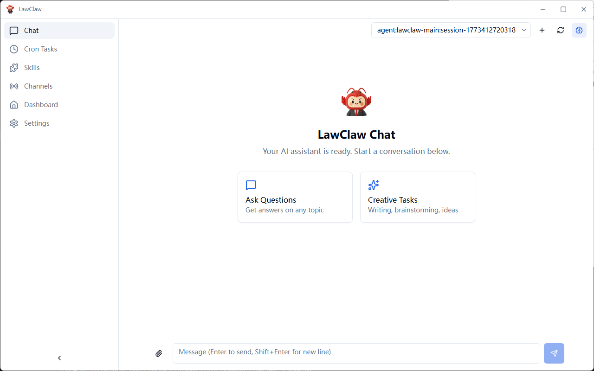
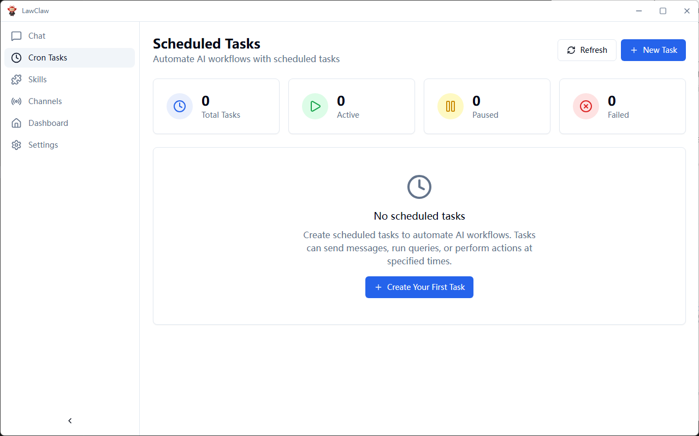
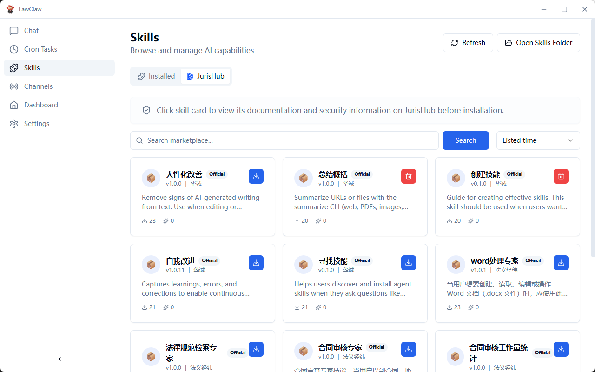
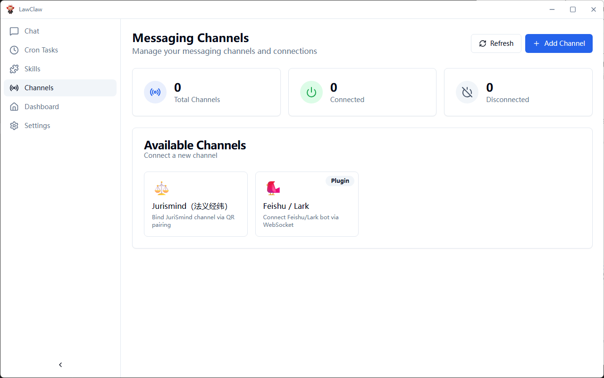
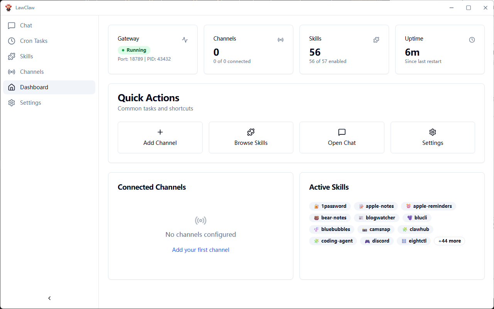
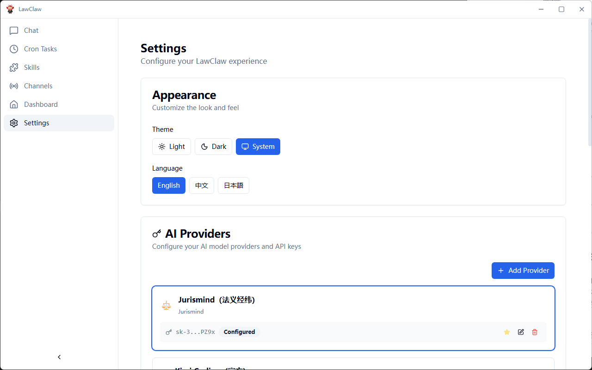

<p align="center">
  
</p>

<h1 align="center">小龙芯 (LawClaw)</h1>

<p align="center">
  <strong>Professional AI Assistant for Legal Professionals</strong>
</p>

<p align="center">
  <a href="#features">Features</a> •
  <a href="#why-lawclaw">Why LawClaw</a> •
  <a href="#getting-started">Getting Started</a> •
  <a href="#architecture">Architecture</a> •
  <a href="#development">Development</a> •
  <a href="#contributing">Contributing</a>
</p>

<p align="center">
  
  
  
  <a href="https://discord.com/invite/84Kex3GGAh" target="_blank">
  
  </a>
  
  
</p>

<p align="center">
  English | <a href="README.zh-CN.md">简体中文</a>
</p>

---

## Overview

**小龙芯 (LawClaw)** is a professional AI assistant desktop application built on top of [ClawX](https://github.com/ValueCell-ai/ClawX), customized by 法义经纬 (Jurismind) for lawyers and legal professionals.

ClawX is the official desktop client for [OpenClaw](https://github.com/OpenClaw), transforming command-line AI orchestration into an accessible, beautiful desktop experience. 小龙芯 extends this powerful foundation with legal domain specialization, providing intelligent legal research, document analysis, case summary, and contract review capabilities.

It comes pre-configured with best-practice model providers and natively supports Windows as well as multi-language settings. Advanced configurations can be accessed via **Settings → Advanced → Developer Mode**.

**Developed by**: 法义经纬 (Jurismind)
**Based on**: [ClawX](https://github.com/ValueCell-ai/ClawX) by ValueCell Team

---
## Screenshot

<p align="center">
  
</p>

<p align="center">
  
</p>

<p align="center">
  
</p>

<p align="center">
  
</p>

<p align="center">
  
</p>

<p align="center">
  
</p>

---

## Why LawClaw

Legal professionals deserve AI tools designed for their specific needs. 小龙芯 (LawClaw) was designed with a simple philosophy: **powerful AI technology tailored for legal practice.**

| Challenge | LawClaw Solution |
|-----------|------------------|
| Complex legal research | AI-powered legal document search and analysis |
| Contract review workload | Intelligent contract review and risk identification |
| Case law research | Smart case retrieval and summary generation |
| Document drafting | AI-assisted legal document generation |
| Multi-language support | Bilingual interface for Chinese/English legal work |

### OpenClaw Inside

ClawX is built directly upon the official **OpenClaw** core. Instead of requiring a separate installation, we embed the runtime within the application to provide a seamless "battery-included" experience.

We are committed to maintaining strict alignment with the upstream OpenClaw project, ensuring that you always have access to the latest capabilities, stability improvements, and ecosystem compatibility provided by the official releases.

---

## Features

### 🎯 Professional Legal AI Interface
Complete the entire setup—from installation to your first AI legal consultation—through an intuitive graphical interface designed for legal professionals.

### 💬 Intelligent Legal Chat
Communicate with AI through a modern chat experience specialized for legal queries. Support for multiple case contexts, message history, and rich content rendering with legal citations.

### 📋 Contract Analysis & Review
Intelligent contract review with risk identification, clause analysis, and modification suggestions. Support for common contract templates and legal compliance checking.

### 📚 Case Law Research
AI-powered case law search and analysis. Quickly retrieve relevant precedents, generate case summaries, and identify key legal points.

### 📝 Document Drafting Assistant
Generate legal documents, legal opinions, and case briefs with AI assistance. Support for various legal document templates and formats.

### 🧩 Extensible Legal Skills
Extend your AI assistant with specialized legal skills. Browse, install, and manage legal domain skills through the integrated skill panel.

### 🔐 Secure & Private
All data processed locally with secure credential storage. Your legal documents and consultations remain private and protected.

### 🌙 Adaptive Theming
Light mode, dark mode, or system-synchronized themes. LawClaw adapts to your preferences automatically.

---

## Getting Started

### System Requirements

- **Operating System**: macOS 11+, Windows 10+, or Linux (Ubuntu 20.04+)
- **Memory**: 4GB RAM minimum (8GB recommended)
- **Storage**: 1GB available disk space

### Installation

#### Pre-built Releases (Recommended)

Download the latest release for your platform from the [Releases](https://github.com/ValueCell-ai/ClawX/releases) page.

#### Build from Source

```bash
# Clone the repository
git clone https://github.com/ValueCell-ai/ClawX.git
cd ClawX

# Initialize the project
pnpm run init

# Start in development mode
pnpm dev
```

### First Launch

When you launch LawClaw for the first time, the **Setup Wizard** will guide you through:

1. **Language & Region** – Configure your preferred locale (中文/English)
2. **AI Provider** – Enter your API keys for supported providers
3. **Legal Skills** – Select pre-configured legal skill bundles
4. **Verification** – Test your configuration before entering the main interface

---

## Architecture

小龙芯 (LawClaw) employs a **dual-process architecture** that separates UI concerns from AI runtime operations:

```
┌─────────────────────────────────────────────────────────────────┐
│                        ClawX Desktop App                         │
│                                                                  │
│  ┌────────────────────────────────────────────────────────────┐  │
│  │              Electron Main Process                          │  │
│  │  • Window & application lifecycle management               │  │
│  │  • Gateway process supervision                              │  │
│  │  • System integration (tray, notifications, keychain)       │  │
│  │  • Auto-update orchestration                                │  │
│  └────────────────────────────────────────────────────────────┘  │
│                              │                                    │
│                              │ IPC                                │
│                              ▼                                    │
│  ┌────────────────────────────────────────────────────────────┐  │
│  │              React Renderer Process                         │  │
│  │  • Modern component-based UI (React 19)                     │  │
│  │  • State management with Zustand                            │  │
│  │  • Real-time WebSocket communication                        │  │
│  │  • Rich Markdown rendering                                  │  │
│  └────────────────────────────────────────────────────────────┘  │
└──────────────────────────────┬──────────────────────────────────┘
                               │
                               │ WebSocket (JSON-RPC)
                               ▼
┌─────────────────────────────────────────────────────────────────┐
│                     OpenClaw Gateway                             │
│                                                                  │
│  • AI agent runtime and orchestration                           │
│  • Message channel management                                    │
│  • Skill/plugin execution environment                           │
│  • Provider abstraction layer                                    │
└─────────────────────────────────────────────────────────────────┘
```

### Design Principles

- **Process Isolation**: The AI runtime operates in a separate process, ensuring UI responsiveness even during heavy computation
- **Graceful Recovery**: Built-in reconnection logic with exponential backoff handles transient failures automatically
- **Secure Storage**: API keys and sensitive data leverage the operating system's native secure storage mechanisms
- **Hot Reload**: Development mode supports instant UI updates without restarting the gateway

---

## Use Cases

### 🤖 Legal Research Assistant
Quickly search and analyze case law, statutes, and legal precedents. Generate case summaries and identify relevant legal principles for your cases.

### 📋 Contract Review & Analysis
Automatically identify risks, unusual clauses, and compliance issues in contracts. Generate review reports with modification suggestions.

### 💻 Legal Document Drafting
Generate legal documents, contracts, legal opinions, and case briefs with AI assistance. Use templates for various legal document types.

### 🔄 Case Management Integration
Connect with your case management systems to automate routine tasks, schedule reminders, and track case progress.

---

## Development

### Prerequisites

- **Node.js**: 22+ (LTS recommended)
- **Package Manager**: pnpm 9+ (recommended) or npm

### Project Structure

```
ClawX/
├── electron/              # Electron Main Process
│   ├── main/             # Application entry, window management
│   ├── gateway/          # OpenClaw Gateway process manager
│   ├── preload/          # Secure IPC bridge scripts
│   └── utils/            # Utilities (storage, auth, paths)
├── src/                   # React Renderer Process
│   ├── components/       # Reusable UI components
│   │   ├── ui/          # Base components (shadcn/ui)
│   │   ├── layout/      # Layout components (sidebar, header)
│   │   └── common/      # Shared components
│   ├── pages/           # Application pages
│   │   ├── Setup/       # Initial setup wizard
│   │   ├── Dashboard/   # Home dashboard
│   │   ├── Chat/        # AI chat interface
│   │   ├── Channels/    # Channel management
│   │   ├── Skills/      # Skill browser & manager
│   │   ├── Cron/        # Scheduled tasks
│   │   └── Settings/    # Configuration panels
│   ├── stores/          # Zustand state stores
│   ├── lib/             # Frontend utilities
│   └── types/           # TypeScript type definitions
├── resources/            # Static assets (icons, images)
├── scripts/              # Build & utility scripts
└── tests/               # Test suites
```

### Available Commands

```bash
# Development
pnpm dev                  # Start with hot reload
pnpm dev:electron         # Launch Electron directly

# Quality
pnpm lint                 # Run ESLint
pnpm lint:fix             # Auto-fix issues
pnpm typecheck            # TypeScript validation

# Testing
pnpm test                 # Run unit tests
pnpm test:watch           # Watch mode
pnpm test:coverage        # Generate coverage report
pnpm test:e2e             # Run Playwright E2E tests

# Build & Package
pnpm build                # Full production build
pnpm package              # Package for current platform
pnpm package:mac          # Package for macOS
pnpm package:win          # Package for Windows
pnpm package:linux        # Package for Linux
```

### Tech Stack

| Layer | Technology |
|-------|------------|
| Runtime | Electron 40+ |
| UI Framework | React 19 + TypeScript |
| Styling | Tailwind CSS + shadcn/ui |
| State | Zustand |
| Build | Vite + electron-builder |
| Testing | Vitest + Playwright |
| Animation | Framer Motion |
| Icons | Lucide React |

---

## Contributing

We welcome contributions from the community! Whether it's bug fixes, new features, documentation improvements, or translations—every contribution helps make ClawX better.

### How to Contribute

1. **Fork** the repository
2. **Create** a feature branch (`git checkout -b feature/amazing-feature`)
3. **Commit** your changes with clear messages
4. **Push** to your branch
5. **Open** a Pull Request

### Guidelines

- Follow the existing code style (ESLint + Prettier)
- Write tests for new functionality
- Update documentation as needed
- Keep commits atomic and descriptive

---

## Acknowledgments

小龙芯 (LawClaw) is built on the shoulders of excellent open-source projects:

- **[ClawX](https://github.com/ValueCell-ai/ClawX)** – The upstream project this is based on, developed by ValueCell Team
- [OpenClaw](https://github.com/OpenClaw) – The AI agent runtime
- [Electron](https://www.electronjs.org/) – Cross-platform desktop framework
- [React](https://react.dev/) – UI component library
- [shadcn/ui](https://ui.shadcn.com/) – Beautifully designed components
- [Zustand](https://github.com/pmndrs/zustand) – Lightweight state management

---

## Community

Join our community to connect with other users, get support, and share your experiences.

| Enterprise WeChat | Feishu Group | Discord |
| :---: | :---: | :---: |
|  |  |  |

---

## License

ClawX is released under the [MIT License](LICENSE). You're free to use, modify, and distribute this software.

---

<p align="center">
  <sub>Built with ❤️ by 法义经纬 (Jurismind) | Based on <a href="https://github.com/ValueCell-ai/ClawX">ClawX</a></sub>
</p>
