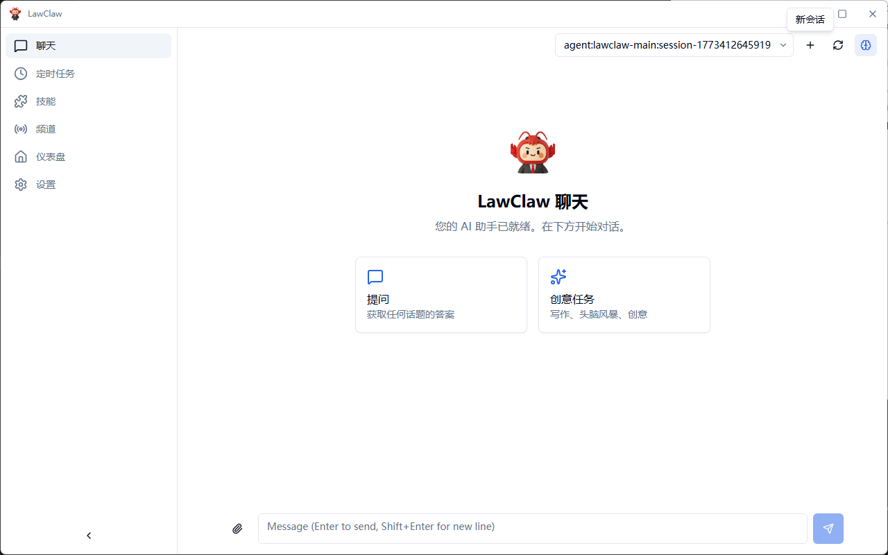
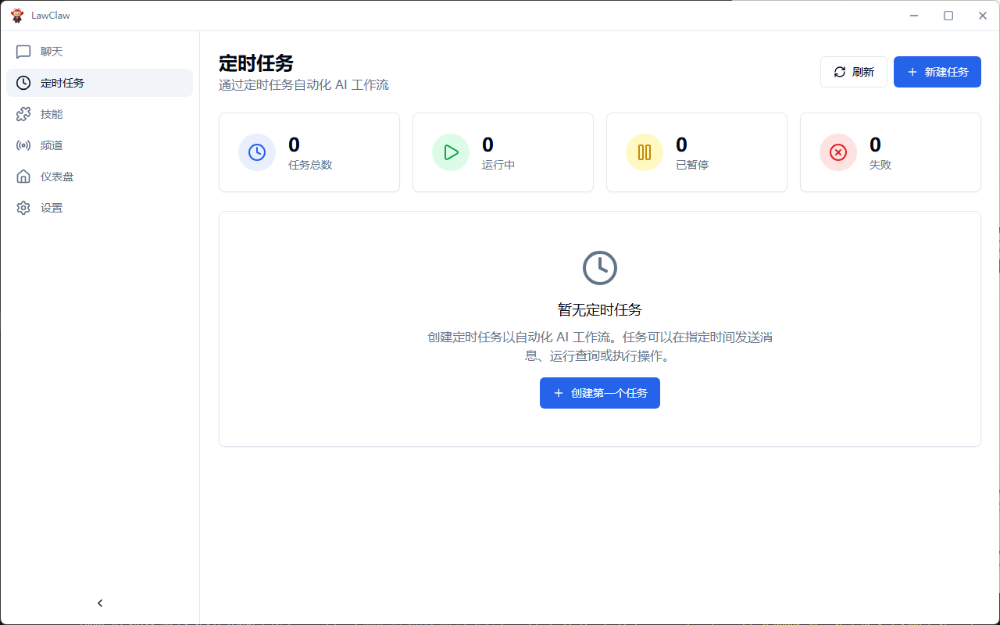
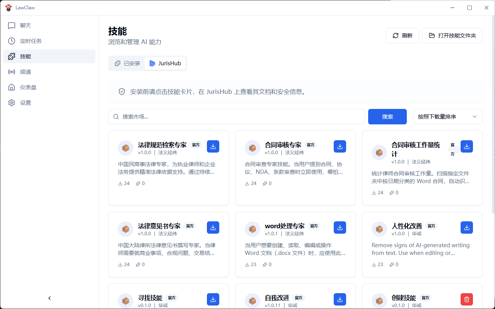
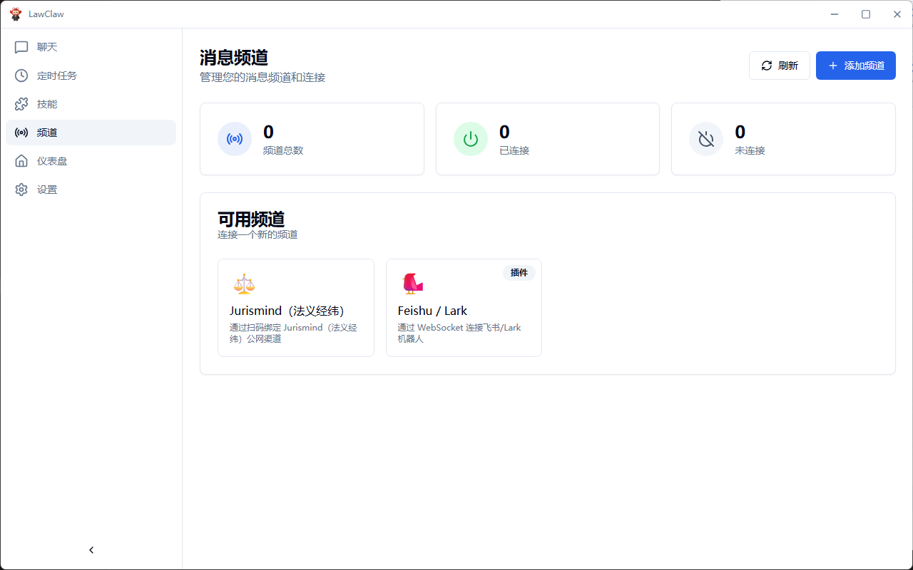
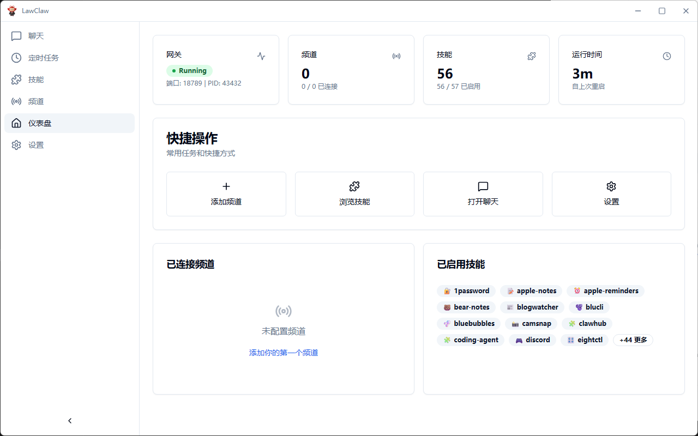
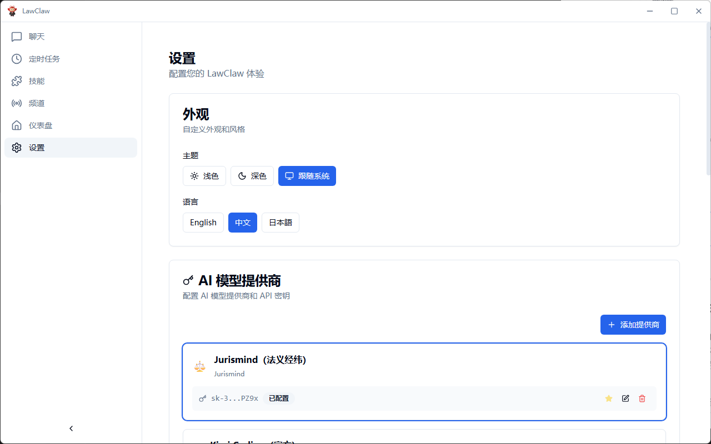

<p align="center">
  
</p>

<h1 align="center">小龙芯 (LawClaw)</h1>

<p align="center">
  <strong>专业律师AI助手桌面应用</strong>
</p>

<p align="center">
  <a href="#功能特性">功能特性</a> •
  <a href="#为什么选择-lawclaw">为什么选择 LawClaw</a> •
  <a href="#快速上手">快速上手</a> •
  <a href="#系统架构">系统架构</a> •
  <a href="#开发指南">开发指南</a> •
  <a href="#参与贡献">参与贡献</a>
</p>

<p align="center">
  
  
  
  <a href="https://discord.com/invite/84Kex3GGAh" target="_blank">
  
  </a>
  
  
</p>

<p align="center">
  <a href="README.md">English</a> | 简体中文
</p>

---

## 概述

**小龙芯 (LawClaw)** 是基于 [ClawX](https://github.com/ValueCell-ai/ClawX) 项目构建的律师AI助手桌面应用，由法义经纬 (Jurismind) 进行法律领域定制开发。

ClawX 是 [OpenClaw](https://github.com/OpenClaw) 的官方桌面客户端，将命令行式的 AI 编排转变为易用、美观的桌面体验。小龙芯在此强大基础上，针对法律行业进行深度定制，提供智能法律研究、文档分析、案件摘要和合同审查等专业功能。

应用预置了最佳实践的模型供应商配置，原生支持 Windows 平台以及中英双语界面。高级配置可通过 **设置 → 高级 → 开发者模式** 进行调整。

**开发团队**：法义经纬 (Jurismind)
**基于项目**：[ClawX](https://github.com/ValueCell-ai/ClawX) by ValueCell Team

---

## 截图预览

<p align="center">
  
</p>

<p align="center">
  
</p>

<p align="center">
  
</p>

<p align="center">
  
</p>

<p align="center">
  
</p>

<p align="center">
  
</p>

---

## 为什么选择 LawClaw

法律专业人士值得拥有专为法律领域定制的AI工具。小龙芯的设计理念很简单：**强大的AI技术结合法律专业场景，提供高效、精准的法律服务支持。**

| 痛点 | LawClaw 解决方案 |
|------|----------------|
| 复杂的法律检索 | AI智能法律文献搜索与分析 |
| 合同审查工作量大 | 智能合同审查与风险识别 |
| 案例研究效率低 | 智能案例检索与摘要生成 |
| 法律文书撰写耗时 | AI辅助法律文书生成 |
| 多语言法律工作 | 中英双语界面支持 |

### 内置 OpenClaw 核心

ClawX 直接基于官方 **OpenClaw** 核心构建。无需单独安装，我们将运行时嵌入应用内部，提供开箱即用的无缝体验。

我们致力于与上游 OpenClaw 项目保持严格同步，确保你始终可以使用官方发布的最新功能、稳定性改进和生态兼容性。

---

## 功能特性

### 🎯 专业法律AI界面
专为法律专业人士设计，从安装到第一次法律咨询，全程通过直观的图形界面完成。

### 💬 智能法律对话
通过现代化的聊天体验与法律AI交互。支持多案件上下文、对话历史记录以及法律文书富文本渲染。

### 📋 合同分析与审查
智能合同审查，自动识别风险条款、合规问题和修改建议。支持常见合同模板和法律合规检查。

### 📚 案例法律研究
AI驱动的案例检索与分析。快速检索相关判例、生成案件摘要、识别关键法律要点。

### 📝 法律文书生成
AI辅助生成法律文书、法律意见书、案件简报等。支持多种法律文书模板和格式。

### 🧩 可扩展法律技能
通过专业技能扩展AI助手能力。在集成的技能面板中浏览、安装和管理法律领域技能。

### 🔐 安全隐私保护
所有数据本地处理，凭证安全存储在系统原生密钥链中。法律文档和咨询内容保持私密和安全。

### 🌙 自适应主题
支持浅色模式、深色模式或跟随系统主题。小龙芯自动适应您的偏好设置。

---

## 快速上手

### 系统要求

- **操作系统**：macOS 11+、Windows 10+ 或 Linux（Ubuntu 20.04+）
- **内存**：最低 4GB RAM（推荐 8GB）
- **存储空间**：1GB 可用磁盘空间

### 安装方式

#### 预构建版本（推荐）

从 [Releases](https://github.com/ValueCell-ai/ClawX/releases) 页面下载适用于你平台的最新版本。

#### 从源码构建

```bash
# 克隆仓库
git clone https://github.com/ValueCell-ai/ClawX.git
cd ClawX

# 初始化项目
pnpm run init

# 以开发模式启动
pnpm dev
```

### 首次启动

首次启动小龙芯时，**设置向导** 将引导您完成以下步骤：

1. **语言与区域** – 配置您的首选语言（中文/English）
2. **AI 供应商** – 输入所支持供应商的 API 密钥
3. **法律技能包** – 选择适用于法律场景的预配置技能
4. **验证** – 在进入主界面前测试您的配置

---

## 系统架构

小龙芯采用 **双进程架构**，将 UI 层与 AI 运行时操作分离：

```
┌─────────────────────────────────────────────────────────────────┐
│                        ClawX 桌面应用                             │
│                                                                  │
│  ┌────────────────────────────────────────────────────────────┐  │
│  │              Electron 主进程                                 │  │
│  │  • 窗口与应用生命周期管理                                      │  │
│  │  • 网关进程监控                                               │  │
│  │  • 系统集成（托盘、通知、密钥链）                                │  │
│  │  • 自动更新编排                                               │  │
│  └────────────────────────────────────────────────────────────┘  │
│                              │                                    │
│                              │ IPC                                │
│                              ▼                                    │
│  ┌────────────────────────────────────────────────────────────┐  │
│  │              React 渲染进程                                   │  │
│  │  • 现代组件化 UI（React 19）                                   │  │
│  │  • Zustand 状态管理                                           │  │
│  │  • WebSocket 实时通信                                         │  │
│  │  • Markdown 富文本渲染                                        │  │
│  └────────────────────────────────────────────────────────────┘  │
└──────────────────────────────┬──────────────────────────────────┘
                               │
                               │ WebSocket (JSON-RPC)
                               ▼
┌─────────────────────────────────────────────────────────────────┐
│                     OpenClaw 网关                                 │
│                                                                  │
│  • AI 智能体运行时与编排                                          │
│  • 消息频道管理                                                   │
│  • 技能/插件执行环境                                              │
│  • 供应商抽象层                                                   │
└─────────────────────────────────────────────────────────────────┘
```

### 设计原则

- **进程隔离**：AI 运行时在独立进程中运行，确保即使在高负载计算期间 UI 也能保持响应
- **优雅恢复**：内置带指数退避的重连逻辑，自动处理瞬时故障
- **安全存储**：API 密钥和敏感数据利用操作系统原生的安全存储机制
- **热重载**：开发模式支持即时 UI 更新，无需重启网关

---

## 使用场景

### 🤖 法律智能助手
配置专业的法律AI助手，可以解答法律问题、撰写法律文书、总结案情并协助处理日常法律事务——全部通过简洁的桌面界面完成。

### 📋 合同智能审查
利用AI智能审查合同条款，识别潜在风险、合规问题和修改建议。支持常见合同模板和法律合规检查。

### 💻 律师效率工具
将AI融入您的法律工作流程。使用AI助手进行案例检索、生成法律意见书或自动化重复性文书工作。

### 🔄 案件管理集成
连接您的案件管理系统，自动化日常任务、设置提醒并跟踪案件进展。

---

## 开发指南

### 前置要求

- **Node.js**：22+（推荐 LTS 版本）
- **包管理器**：pnpm 9+（推荐）或 npm

### 项目结构

```
ClawX/
├── electron/              # Electron 主进程
│   ├── main/             # 应用入口、窗口管理
│   ├── gateway/          # OpenClaw 网关进程管理
│   ├── preload/          # 安全 IPC 桥接脚本
│   └── utils/            # 工具模块（存储、认证、路径）
├── src/                   # React 渲染进程
│   ├── components/       # 可复用 UI 组件
│   │   ├── ui/          # 基础组件（shadcn/ui）
│   │   ├── layout/      # 布局组件（侧边栏、顶栏）
│   │   └── common/      # 公共组件
│   ├── pages/           # 应用页面
│   │   ├── Setup/       # 初始设置向导
│   │   ├── Dashboard/   # 首页仪表盘
│   │   ├── Chat/        # AI 聊天界面
│   │   ├── Channels/    # 频道管理
│   │   ├── Skills/      # 技能浏览与管理
│   │   ├── Cron/        # 定时任务
│   │   └── Settings/    # 配置面板
│   ├── stores/          # Zustand 状态仓库
│   ├── lib/             # 前端工具库
│   └── types/           # TypeScript 类型定义
├── resources/            # 静态资源（图标、图片）
├── scripts/              # 构建与工具脚本
└── tests/               # 测试套件
```

### 常用命令

```bash
# 开发
pnpm dev                  # 以热重载模式启动
pnpm dev:electron         # 直接启动 Electron

# 代码质量
pnpm lint                 # 运行 ESLint 检查
pnpm lint:fix             # 自动修复问题
pnpm typecheck            # TypeScript 类型检查

# 测试
pnpm test                 # 运行单元测试
pnpm test:watch           # 监听模式
pnpm test:coverage        # 生成覆盖率报告
pnpm test:e2e             # 运行 Playwright E2E 测试

# 构建与打包
pnpm build                # 完整生产构建
pnpm package              # 为当前平台打包
pnpm package:mac          # 为 macOS 打包
pnpm package:win          # 为 Windows 打包
pnpm package:linux        # 为 Linux 打包
```

### 技术栈

| 层级 | 技术 |
|------|------|
| 运行时 | Electron 40+ |
| UI 框架 | React 19 + TypeScript |
| 样式 | Tailwind CSS + shadcn/ui |
| 状态管理 | Zustand |
| 构建工具 | Vite + electron-builder |
| 测试 | Vitest + Playwright |
| 动画 | Framer Motion |
| 图标 | Lucide React |

---

## 参与贡献

我们欢迎社区的各种贡献！无论是修复 Bug、开发新功能、改进文档还是翻译——每一份贡献都让 ClawX 变得更好。

### 如何贡献

1. **Fork** 本仓库
2. **创建** 功能分支（`git checkout -b feature/amazing-feature`）
3. **提交** 清晰描述的变更
4. **推送** 到你的分支
5. **创建** Pull Request

### 贡献规范

- 遵循现有代码风格（ESLint + Prettier）
- 为新功能编写测试
- 按需更新文档
- 保持提交原子化且描述清晰

---

## 致谢

小龙芯 基于以下优秀的开源项目构建：

- **[ClawX](https://github.com/ValueCell-ai/ClawX)** – 本项目的上游基础，由 ValueCell Team 开发维护
- [OpenClaw](https://github.com/OpenClaw) – AI 智能体运行时
- [Electron](https://www.electronjs.org/) – 跨平台桌面框架
- [React](https://react.dev/) – UI 组件库
- [shadcn/ui](https://ui.shadcn.com/) – 精美设计的组件库
- [Zustand](https://github.com/pmndrs/zustand) – 轻量级状态管理

---

## 社区

加入我们的社区，与其他用户交流、获取帮助、分享你的使用体验。

| 企业微信 | 飞书群组 | Discord |
| :---: | :---: | :---: |
|  |  |  |

---

## 许可证

ClawX 基于 [MIT 许可证](LICENSE) 发布。你可以自由地使用、修改和分发本软件。

---

<p align="center">
  <sub>由 法义经纬 (Jurismind) 用 ❤️ 打造 | 基于 <a href="https://github.com/ValueCell-ai/ClawX">ClawX</a></sub>
</p>
