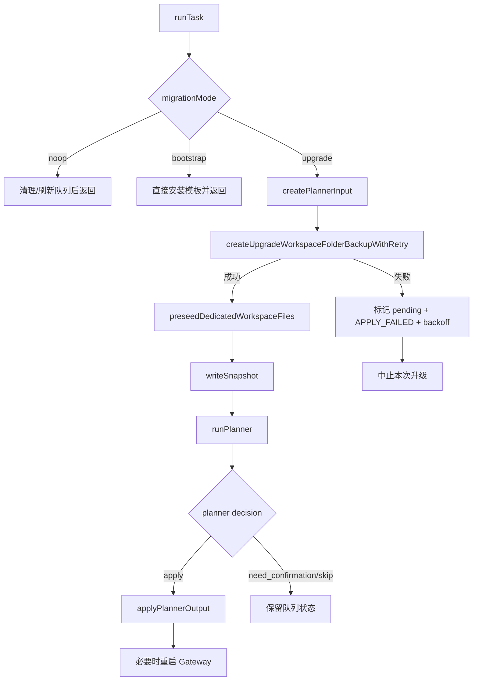

# LawClaw 预设模板升级与目录备份技术报告

## 1. 背景与目标

本次改造的目标是将升级前备份策略由“逐文件单独备份”替换为“按升级任务生成目录备份”，并保持升级阶段的 Gateway 运行门控行为不变。

核心目标如下：

1. 仅在 `upgrade` 阶段执行目录备份。
2. 备份对象为 `lawclaw-main` 的 `manifest.workspaceFiles` 相关文件。
3. 每次升级任务都先备份，后执行 planner 与写入。
4. 备份失败时重试 3 次，仍失败则中止本次升级并保留队列任务。

## 2. 升级触发时机与 Gateway 判定

迁移协调器在 `runDueTask()` 中执行任务前，会检查 `isGatewayRunning()`：

1. 若 Gateway 未运行：本次不执行升级，队列任务保留。
2. 若 Gateway 运行：进入 `runTask()`，处理 `upgrade`。

因此升级执行满足“Gateway running 门控通过后进入任务”的要求。

## 3. 迁移模式判定逻辑

迁移模式由以下条件决定：

1. `bootstrap`：不存在 `v_current` 快照时。
2. `noop`：`sourceHash === targetHash` 且未启用强制覆盖参数。
3. `upgrade`：其余需要从旧模板升级到新模板的场景。

本次目录备份逻辑仅应用于 `upgrade`。

## 4. 升级执行流程（含目录备份）

## 5. 目录备份设计

### 5.1 存储位置与命名

备份根目录：

`~/.LawClaw/agent-presets/backups/`

每次升级目录命名：

`<ISO时间戳>-<taskId>-<targetHash前8位>`

### 5.2 备份内容

1. `backup-meta.json`：
   1. `taskId`
   2. `sourceHash`
   3. `targetHash`
   4. `createdAt`
   5. `agentId`
   6. `workspacePath`
   7. 文件清单（含是否存在、hash、字节数、备份相对路径）
2. `manifest.workspaceFiles` 对应且当前存在的文件内容，保持相对路径结构（如 `SOUL.md`、`skills/lawclaw-upgrade/SKILL.md`）。

### 5.3 备份范围

固定为 `lawclaw-main` 的受管文件，不做 workspace 全量备份，不做自动清理。

## 6. 失败处理策略

目录备份采用重试策略：

1. 重试延迟：`200ms`、`500ms`、`1000ms`。
2. 总尝试次数：4 次（初次 + 3 次重试）。
3. 全部失败后：
   1. 本次升级停止，不执行后续写入。
   2. 任务写回队列为 `pending`。
   3. 失败原因标记为 `APPLY_FAILED`。
   4. `lastError` 明确包含 `backup failed` 文本。

## 7. 回滚与排障指引

### 7.1 回滚步骤

1. 定位对应升级任务目录：`~/.LawClaw/agent-presets/backups/<timestamp-task-hash>/`
2. 查看 `backup-meta.json` 确认任务哈希与文件列表。
3. 将备份目录中的文件按相对路径恢复到 `workspace-lawclaw-main`。
4. 必要时重启 Gateway 使上下文重新加载。

### 7.2 排障关注点

1. 备份目录根路径是否可写（文件/目录冲突、权限问题）。
2. `backup-meta.json` 是否存在且字段完整。
3. 队列状态是否为 `pending + APPLY_FAILED`，以及 `lastError` 是否标注 `backup failed`。
4. Gateway 是否处于 `running`，避免误判为升级逻辑无触发。

## 8. 测试覆盖

本次新增/调整了以下关键验证：

1. `upgrade` 会生成目录备份，且含 `backup-meta.json` 与受管文件快照。
2. 备份失败会重试并最终中止升级，队列保留为可重试状态。
3. 旧逐文件备份断言已移除，改为目录备份断言。
4. 全量测试、类型检查均通过。
